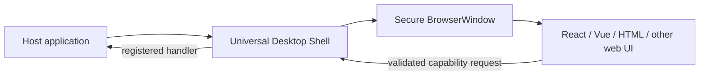
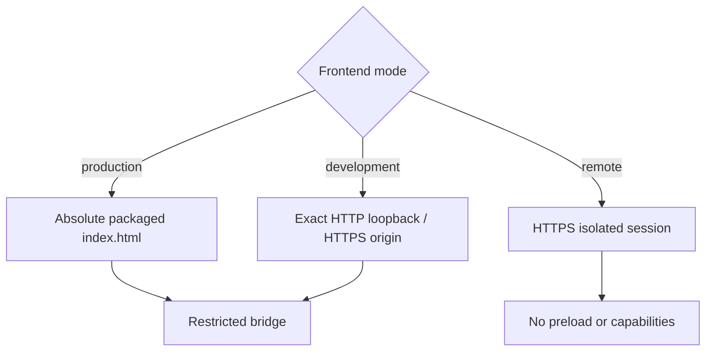

# Universal Desktop Shell

A secure, reusable Electron window shell for Windows and Linux. It loads any browser-compatible frontend while keeping Node.js, operating-system access, secrets, and business logic outside the renderer.



## What is included

| Capability | Behavior |
| --- | --- |
| Frontends | Packaged local builds, explicit dev origins, isolated remote content |
| Windows | Named multi-window manager; one primary window by default |
| Security | Isolation, sandbox, no renderer Node.js, navigation/popup/permission controls |
| Bridge | Typed renderer API, allowlisted actions/events, Zod schemas, sender and size checks |
| Reliability | Safe fallback, bounded dev retry, crash-loop protection, abortable actions |
| State | Atomic window-state persistence with display-bound validation |
| Lifecycle | Opaque handles plus optional single-instance app helper |

Business services, tokens, databases, installers, updates, and product UI remain host-owned.

## Requirements

- Node.js 22 or newer for development
- Electron 35–44 as a peer dependency
- A browser-compatible frontend

## Install and validate

```bash
npm install
npm run validate
```

The package is currently local. A host project can install it from a path or repository after it is published.

## Minimal host

```ts
import { join } from "node:path";
import { z } from "zod";
import { runDesktopShellApp } from "universal-desktop-shell";

void runDesktopShellApp({
  shell: {
    actions: {
      "app.getInfo": {
        capability: "app.basic",
        input: z.object({}),
        output: z.object({ name: z.string() }),
        handler: () => ({ name: "My App" })
      }
    }
  },
  createPrimary: (shell) =>
    shell.createWindow("main", {
      title: "My App",
      restoreState: true,
      capabilities: ["app.basic"],
      frontend: {
        mode: "production",
        indexPath: join(__dirname, "renderer", "index.html")
      }
    })
});
```

## Frontend bridge

```ts
import { getDesktopShellBridge } from "universal-desktop-shell/renderer";

type Actions = {
  "app.getInfo": { input: {}; output: { name: string } };
};

const bridge = getDesktopShellBridge<Actions>();
bridge.ready();
const info = await bridge.invoke("app.getInfo", {});
```

The frontend never receives raw Electron or IPC objects. The main process verifies the window, frame origin, capability, envelope, payload schema, result schema, timeout, and byte limit.

## Frontend modes



## Direct manager API

Use `createDesktopShell()` when the host already manages Electron lifecycle:

```ts
const shell = createDesktopShell({ actions, events });
const window = await shell.createWindow("main", config);

window.show();
window.focus();
await window.reload();
await shell.dispose();
```

Handles deliberately expose window operations, not raw `BrowserWindow` instances.

## Example

The repository includes a plain HTML host fixture:

```bash
npm run example
```

Its frontend is under [`examples/basic/frontend`](examples/basic/frontend) and communicates through one validated `app.describe` capability.

## Project structure

```text
src/
├── desktop-shell.ts       window manager, policies, lifecycle, recovery
├── app-lifecycle.ts       optional single-instance application helper
├── preload.ts             restricted renderer bridge
├── action-router.ts       schemas, capabilities, timeouts, limits
├── security.ts            immutable BrowserWindow preferences
├── state-adapter.ts       atomic OS app-data window state
└── renderer.ts            typed frontend API
```

## Documentation

- [Requirements and architecture](docs/requirements-and-architecture.md)
- [Accepted design decisions](docs/design-decisions.md)
- [Security review](docs/security-review-plan.md)
- [Optimization plan](docs/optimization-plan.md)

## Commands

| Command | Purpose |
| --- | --- |
| `npm run check` | Type-check source and tests |
| `npm test` | Run unit/security tests |
| `npm run build` | Produce CommonJS and declaration bundles in `dist/` |
| `npm run validate` | Type-check, test, and build |
| `npm run test:electron` | Launch a headless Electron window and verify the bridge |
| `npm run example` | Build and open the plain HTML example |

## Status

Version `0.1.0` implements the reusable core. Packaged Windows/Linux smoke tests, signing, installers, and update flows are host/release-pipeline responsibilities and are not claimed by the local unit suite.
