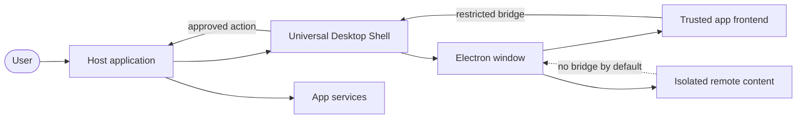
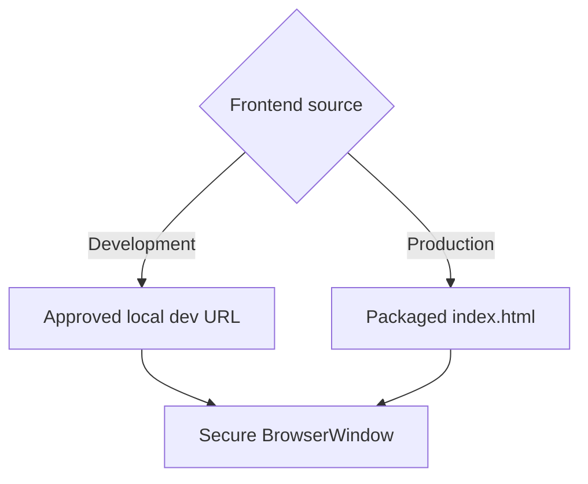
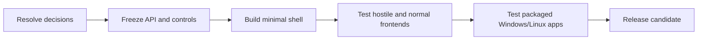

# Universal Desktop Shell

A reusable Electron shell that opens a secure Windows/Linux desktop window and displays any browser-compatible frontend.

> Status: architecture decisions accepted. The project is ready for a detailed implementation plan and phased development.

## At a glance

| The shell does | The shell does not |
| --- | --- |
| Create and manage desktop windows | Implement product business logic |
| Load a local build or development URL | Own Gmail, DB, AI, Nodrica, or portals |
| Isolate the frontend from Node.js/OS access | Store tokens, cookies, or credentials |
| Provide a narrow host bridge | Expose raw IPC, filesystem, or shell APIs |
| Report lifecycle and load failures | Build or dictate the frontend framework |

## Compatible frontends

React, Vue, Angular, Svelte, plain HTML/JavaScript, and browser-compatible WebAssembly are supported in principle. The frontend must run in a browser environment; native UI frameworks such as WPF, Qt, GTK, and Swing are outside scope.

## Documentation

| Document | Use it for |
| --- | --- |
| [Requirements & Architecture](docs/requirements-and-architecture.md) | Scope, components, lifecycle, and acceptance criteria |
| [Security Review](docs/security-review-plan.md) | Trust boundaries, threats, controls, and verification |
| [Optimization Plan](docs/optimization-plan.md) | Metrics, budgets, performance work, and regression checks |
| [Design Decisions](docs/design-decisions.md) | Accepted choices, rationale, limits, and deferred scope |

## Planned delivery

## Definition of done

- Opens a configured window on Windows and Linux.
- Loads development and packaged browser frontends.
- Gives the renderer no unrestricted Node.js or OS access.
- Allows only registered, validated host actions.
- Recovers safely from load and renderer failures.
- Meets approved performance budgets in packaged builds.
- Contains no product-specific business logic.
