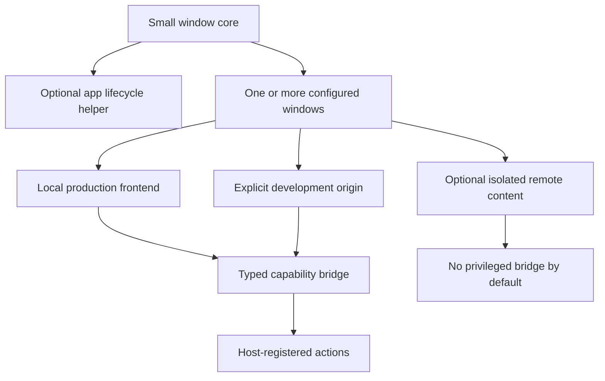
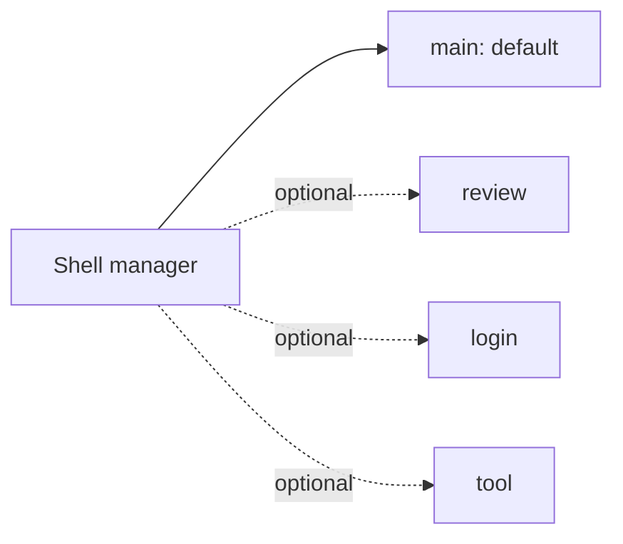
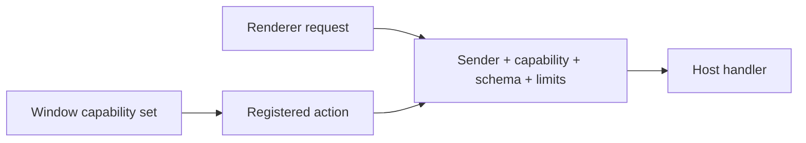

# Design Decisions

These decisions optimize the Universal Desktop Shell for repeated use across unrelated desktop applications. They are accepted defaults, not product-specific rules.

## Decision map



## DEC-001: Layered package ownership

**Decision:** provide two layers.

| Layer | Responsibility |
| --- | --- |
| Window core | Configuration, BrowserWindow, loading, bridge, lifecycle, state, recovery |
| Optional lifecycle helper | App ready, single-instance focus, activate/reopen, conventional quit behavior |
| Host application | Business services, task shutdown, secrets, data, packaging, updates |

**Why:** simple apps get a good default; advanced apps retain control without forking the shell.

## DEC-002: Multi-window capable, single-window default

**Decision:** version one supports multiple named window definitions, but creates only one primary window unless the host asks for more.



Every window has its own configuration, allowed capabilities, source policy, state key, and lifecycle handle. Hidden windows are not used as background workers.

## DEC-003: Frontend source policy

| Mode | Policy |
| --- | --- |
| Production | Packaged local frontend by default |
| Development | Exact host/origin allowlist enabled explicitly |
| Remote content | Opt-in, isolated window, no privileged bridge by default |

Redirects are revalidated. External links open through an approved host policy rather than replacing the application frontend.

**Why:** the shell remains capable of displaying web content without treating arbitrary web pages as trusted application UI.

## DEC-004: Manager and opaque window handles

**Decision:** expose a manager-oriented API and opaque handles rather than raw Electron objects.

```ts
const shell = createDesktopShell(options);
const main = await shell.createWindow("main", config);

main.show();
main.focus();
main.reload();
await main.close();
```

Advanced behavior uses documented host-only hooks. Security-critical `webPreferences` cannot be overridden. Direct `BrowserWindow` access is not part of the stable public API.

## DEC-005: Capability-based bridge

**Decision:** the frontend cannot select arbitrary IPC channels. The host registers named actions and events with schemas and capability assignments.



Responsibility is deliberately layered:

- Shell verifies sender, window capability, envelope, limits, timeout, and registration.
- Host supplies action payload/result schemas and checks product authorization/state.
- Frontend receives only frozen typed functions and safe error/result shapes.

## DEC-006: Session isolation by trust domain

**Decision:** windows share a session only when the host assigns the same explicit trust-domain key.

Defaults:

- packaged application windows use the application trust domain;
- development uses a separate development partition;
- remote-content windows use isolated partitions;
- credentials/cookies never cross trust domains implicitly.

## DEC-007: Shell-owned window state with replaceable storage

**Decision:** the shell owns only window presentation state. It provides:

1. a default atomic JSON adapter under Electron's OS application-data path; and
2. an adapter interface for hosts needing different storage.

Stored values are limited to validated bounds, display hint, and maximized/fullscreen state. Product settings and business data are excluded.

## DEC-008: Bounded recovery

**Decision:** use conservative recovery defaults.

| Failure | Default response |
| --- | --- |
| Packaged asset missing/invalid | No reload loop; show stable failure screen |
| Development server unavailable | Bounded retry with backoff, then manual retry |
| Renderer crash | One automatic recovery attempt in a rolling window |
| Repeated crash | Stable recovery screen with reload/close action |
| Unresponsive renderer | Notify host; offer wait/reload/close policy |

Hosts may lower automatic recovery but may not configure an unlimited retry loop.

## DEC-009: Initial platform scope

| Area | Initial requirement |
| --- | --- |
| Windows | Windows 10/11 x64 smoke and packaged tests |
| Linux | Ubuntu LTS x64 smoke and packaged tests |
| Host examples | Windows installer, AppImage, and DEB |
| Display | Native frame and common scaling/monitor-change tests |
| Later | arm64, additional distributions/desktops, macOS |

The shell remains platform-neutral internally. Additional targets are added after automated runners and package tests exist.

The selected Electron release must support every claimed target; otherwise the platform claim or Electron selection must be revised before implementation.

## DEC-010: Provisional performance gates

Absolute startup results depend on hardware, Electron, frontend, and host services. Version one therefore uses shell-scoped budgets on defined CI/reference machines.

| Metric | Initial gate |
| --- | --- |
| App-ready → window-created | p95 no more than 250 ms for minimal fixture |
| App-ready → visible local surface | p95 no more than 500 ms for minimal fixture |
| Preload initialization | p95 no more than 50 ms for minimal bridge |
| Shell main bundle | No more than 1 MiB minified, excluding Electron/source maps |
| Preload bundle | No more than 150 KiB minified |
| Idle CPU | Median below 1% on reference machine |
| IPC | Default payload limit 1 MiB; normal actions target much smaller payloads |
| Progress events | Default delivered rate capped at 20 updates/second per stream |
| Lifecycle leak test | No listener/process growth; memory trend stabilizes across 20 cycles |
| Regression | More than 10% beyond approved baseline requires review |

Budgets are measured in packaged builds. Baseline evidence may tighten them; any relaxation requires a recorded decision.

## DEC-011: Release gates

All of the following block release:

- mandatory security test failure;
- functional/unit/integration test failure;
- packaged smoke-test failure on a required platform;
- unreviewed performance-budget regression;
- unbounded lifecycle resource growth;
- production package containing development origins or unsafe debug settings;
- undocumented high-severity residual security risk.

## DEC-012: Packaging and distribution ownership

**Decision:** Universal Desktop Shell is a reusable library, not an installer or updater.

The shell repository provides package constraints, artifact inspection helpers, and example host configurations. Each host application owns branding, installers, code signing, update service, rollout, and rollback.

## Versioning policy

- Semantic version the public configuration, manager, handle, bridge, and event contracts.
- Treat security-default weakening as a reviewed breaking change even if TypeScript remains compatible.
- Keep Electron support in an explicit compatibility table once implementation selects its first version.
- Deprecate before removing public behavior whenever a safe migration path exists.

## Deliberately deferred

- macOS and arm64 release support
- custom title bars
- shell-owned telemetry
- unrestricted remote production frontends
- raw Electron object exposure
- automatic update implementation
- business-service plugins inside the shell

New requirements should be accepted only when they remain generic across applications or can be supplied through a bounded extension point.
