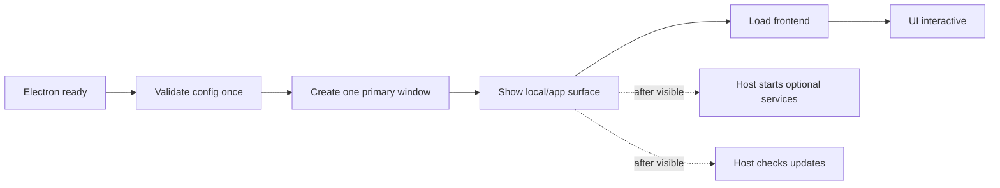
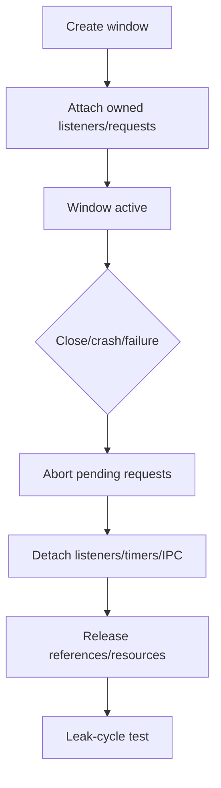
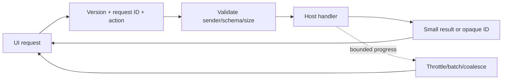
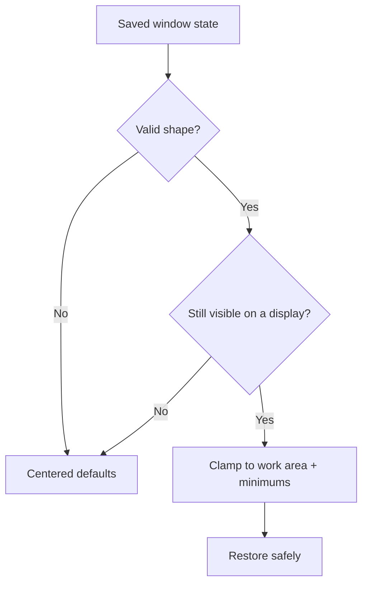
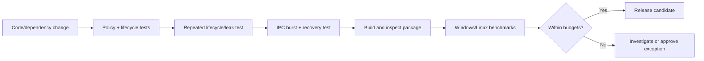

# Optimization Plan

## 1. Goal

Make the shell quick to appear, responsive, memory-conscious, crash-safe, and consistent on Windows/Linux—without weakening security.

> Measure first. Optimize the shell separately from the frontend and host services. Prevent regressions continuously.

## 2. Ownership

| Shell | Host application | Frontend |
| --- | --- | --- |
| Window creation/loading | App startup and single-instance policy | Bundle and render performance |
| Preload and IPC overhead | Business-service initialization | Paging and list virtualization |
| Window cleanup/state | Updates and task shutdown | Asset/font/image optimization |
| Recovery and lifecycle marks | Packaging and telemetry storage | Interaction and accessibility |
| Shell resource limits | Gmail/DB/AI/portal work | UI polling and browser state |

Heavy business services never belong in the renderer or preload.

## 3. Measured lifecycle

```mermaid
gantt
    title Startup marks (durations measured, not implied)
    dateFormat X
    axisFormat %L ms
    section Host
    Process start to app ready       :a, 0, 100
    Host services                    :h, 100, 500
    section Shell
    Create window                    :w, 100, 70
    First visible surface            :v, 170, 30
    Load frontend                    :f, 200, 180
    section Frontend
    Become interactive               :i, 380, 120
```

The numbers above illustrate marks only; they are not targets. `frontend-loaded`, `frontend-interactive`, and `host-ready` must remain distinct.

Measure in packaged builds:

- Cold and warm startup, including median and slow-tail results
- Time to visible shell and interactive frontend
- Main/renderer memory after startup and idle
- Idle CPU
- IPC latency and event throughput by payload class
- Crash recovery time and repeated-crash behavior
- Installer, installed, and unpacked artifact sizes

## 4. Budget model

| Budget field | Example meaning |
| --- | --- |
| Metric | Process start → visible shell |
| Conditions | Cold packaged start, defined hardware class |
| Platforms | Separate Windows and Linux expectations |
| Target | Desired normal result |
| Regression limit | Maximum allowed change from baseline |
| Enforcement | Warning or release blocker |

Targets will be approved only after repeatable baselines exist. The shell owns only the portion of total startup it controls.

## 5. Fast startup path

Rules:

- Keep Gmail, DB, Nodrica, Playwright, AI, updates, and network work off the visible-shell critical path.
- Keep preload small: bridge only, no business imports, caches, or synchronous I/O.
- Use packaged local assets in production.
- Avoid remote fonts/scripts/styles on first display.
- Prefer the main frontend directly; add a tiny local loading surface only if measurements justify it.
- Avoid a separate splash window unless its measured benefit exceeds its process and lifecycle cost.

## 6. Memory and lifecycle

- One primary window by default; no hidden renderer workers.
- Destroy infrequent windows; reuse only when measured and safe for the same trust level.
- Keep normal Chromium background throttling unless a tested requirement says otherwise.
- Test repeated create/load/close cycles for stable memory, process, and listener trends.
- Store durable truth in the host, not renderer memory.

## 7. IPC efficiency and limits

Required policies:

- Maximum request/response bytes, nesting, strings, and item counts
- Pagination or safe handles instead of large datasets/files
- Timeout and best-effort cancellation for long operations
- Bounded event queues and slow-consumer behavior
- Sequence/current-state events where missed progress matters
- Cleanup after reload, close, timeout, or late response
- Serialization/structured-clone cost included in benchmarks

Handles must have authorization, expiry, lifetime, and cleanup rules.

## 8. Window state and responsiveness

Persist normal bounds and optional maximized/fullscreen state through an injected host adapter. Debounce writes; never synchronously persist every move/resize event.

For crash or unresponsive recovery:

- Keep backend state outside the renderer.
- Offer controlled wait/reload/close behavior.
- Limit retries within a time window.
- End in a stable recovery screen instead of a reload loop.
- Normalize missing assets, refused dev server, TLS, network, and invalid-source failures.

## 9. Cross-platform and packaging

| Windows | Linux | Both |
| --- | --- | --- |
| Validate multi-resolution `.ico` | Test chosen package formats/desktops | Native frame first |
| Test installer and warm launch | Do not assume optional desktop services | Test display scaling |
| Test monitor/scaling changes | Keep sandbox; fix package issues properly | Apply theme before meaningful paint |

Packaging checks owned with the host:

- Track dependency and bundle growth.
- Exclude tests, caches, logs, unused binaries, accidental source maps, and debug settings.
- Verify packaged asset paths and contents automatically.
- Minimize native modules and development dependencies.
- Test installed artifacts, not only unpacked development output.
- Define signing and rollback before automatic updates.

## 10. Regression pipeline

Instrumentation must be asynchronous where practical, bounded, optional in production, and redacted. Record durations and categorical context—not user content or sensitive URLs.

## 11. Optimization phases

| Phase | Output |
| --- | --- |
| 1. Baseline | Fixtures, environments, reproducible measurements, proposed budgets |
| 2. Startup | Short critical path and before/after profile |
| 3. Resources | Memory trend, IPC/event limits, cancellation and cleanup tests |
| 4. Recovery/platforms | Recovery tests and Windows/Linux behavior matrix |
| 5. Regression | Package inspection and automated budget gates |

## 12. Release gate

- [ ] Packaged Windows/Linux cold and warm baselines exist.
- [ ] Approved budgets and regression thresholds are automated.
- [ ] Visible shell does not wait for business services.
- [ ] Preload has no heavy imports or synchronous startup work.
- [ ] Repeated lifecycle tests show no unbounded resource growth.
- [ ] IPC payloads, events, timeouts, and cancellations are bounded.
- [ ] Window state survives monitor and scaling changes safely.
- [ ] Recovery cannot loop indefinitely.
- [ ] Production excludes development sources and tooling by default.
- [ ] Package contents and dependency growth are inspected.
- [ ] Security controls remain enabled in every benchmark configuration.

Initial budgets and version-one scope are recorded in [Design Decisions](design-decisions.md). Baseline results may tighten budgets but cannot silently weaken a release gate.
