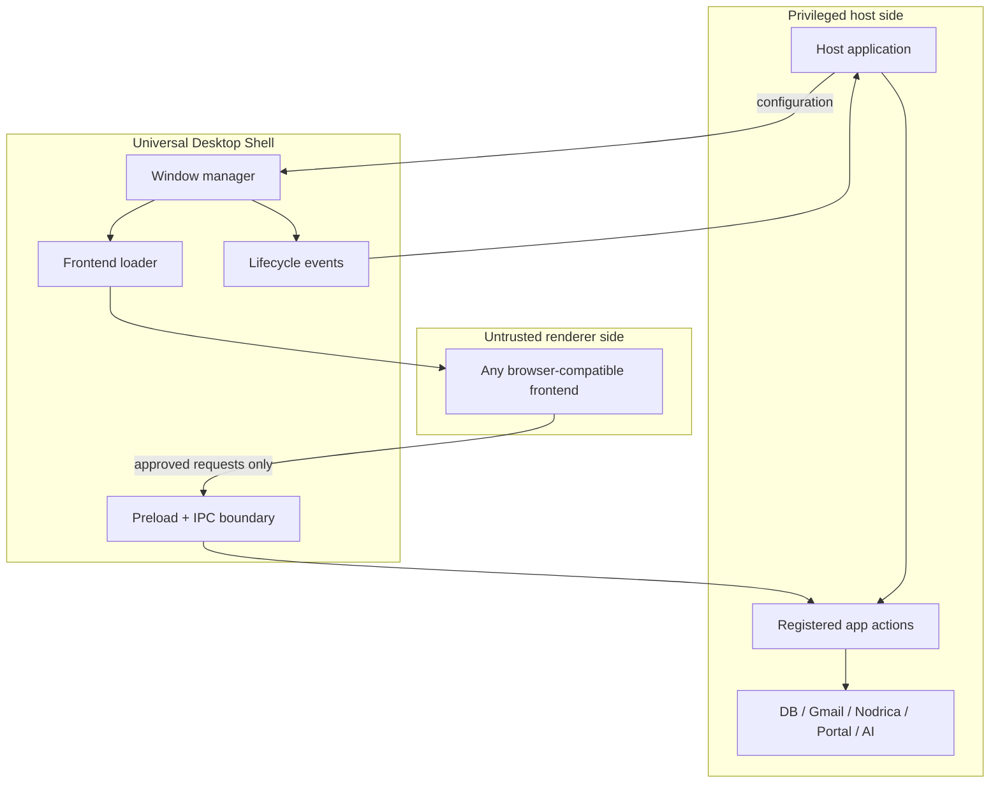
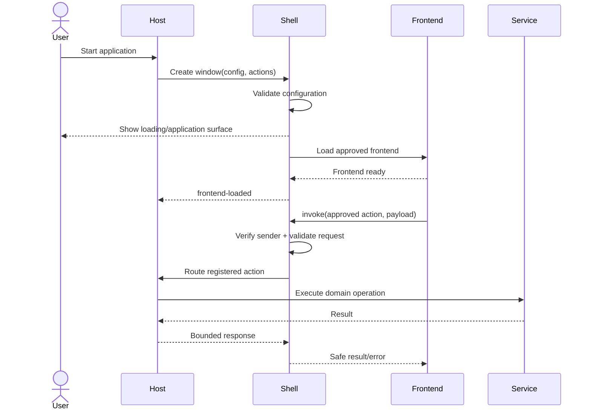
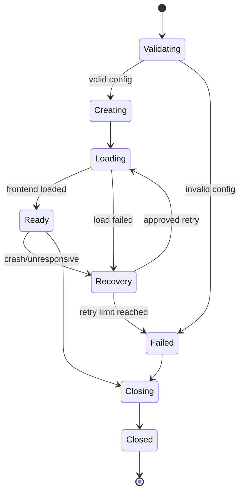
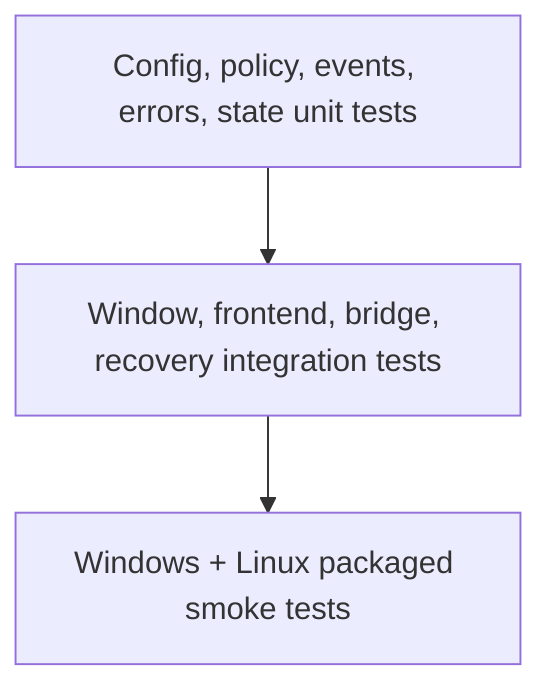

# Requirements and Architecture

## 1. Product definition

Universal Desktop Shell is a reusable Electron window layer between a host application and any browser-compatible frontend.



## 2. Responsibility map

| Component | Owns | Must not own |
| --- | --- | --- |
| Shell | Window creation, loading, lifecycle, bridge boundary, shell events | Business logic, secrets, product persistence |
| Host | Electron app policy, action registration, authorization, service coordination | Renderer UI implementation |
| Frontend | UI, accessibility, interaction, browser-side state | Direct OS, Node.js, token, DB, or cookie access |
| Services | Domain operations and durable state | Window or renderer security policy |

## 3. Runtime sequence



## 4. Functional requirements

| ID | Requirement |
| --- | --- |
| FR-01 | Create a window from validated configuration. |
| FR-02 | Support Windows and Linux from one shared package. |
| FR-03 | Load an approved development URL or packaged local entry file. |
| FR-04 | Remain independent of frontend framework and product domain. |
| FR-05 | Handle ready, show, focus, resize, minimize, maximize, close, and cleanup. |
| FR-06 | Emit created, ready, loaded, failed, crashed, and closed events. |
| FR-07 | Show a safe fallback instead of a blank window after load failure. |
| FR-08 | Expose only registered, typed, validated host actions/events. |
| FR-09 | Reject invalid configuration before window creation. |
| FR-10 | Support reuse through configuration, not internal source changes. |

## 5. Configuration model

Planning shape—not a frozen API:

```ts
type WindowConfig = {
  title: string;
  size?: { width: number; height: number };
  minimumSize?: { width: number; height: number };
  iconPath?: string;
  resizable?: boolean;
  fullscreen?: boolean;
  showOnReady?: boolean;
  theme?: "light" | "dark" | "system";
  restoreState?: boolean;
  frontend:
    | { mode: "development"; url: string }
    | { mode: "production"; indexPath: string };
};
```

An explicit `frontend.mode` prevents contradictory development and production settings.

## 6. Lifecycle ownership



The shell owns window-level transitions. The host decides whether closing the last window quits the whole application and how business tasks stop.

## 7. Cross-platform contract

Guaranteed behavior should cover window creation, loading, core lifecycle, errors, and bridge behavior. Appearance may differ by operating system or Linux desktop environment.

Initial expectations:

- Native frame first; custom title bars are deferred.
- Windows icon assets and Linux icon/package behavior are tested separately.
- Restored bounds remain visible after monitor or scaling changes.
- Common display scaling is included in smoke tests.
- macOS is not an initial supported target.

## 8. Verification pyramid



Test fixtures should include plain HTML, one bundled framework UI, and an intentionally hostile frontend.

## 9. Acceptance criteria

- [ ] Same API loads at least two different frontend technologies.
- [ ] Development and packaged modes work on Windows and Linux.
- [ ] Invalid config and frontend sources fail closed.
- [ ] Renderer cannot access unrestricted Node.js or host capabilities.
- [ ] Host registers and validates a minimal action set.
- [ ] Load, crash, unresponsive, retry, and close paths are tested.
- [ ] No shell module imports product business packages.
- [ ] Security and performance review gates pass.
- [ ] Integration is documented with a minimal example host.

See [Open Decisions](open-decisions.md) before treating this architecture as frozen.
