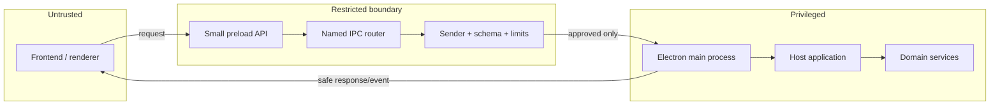
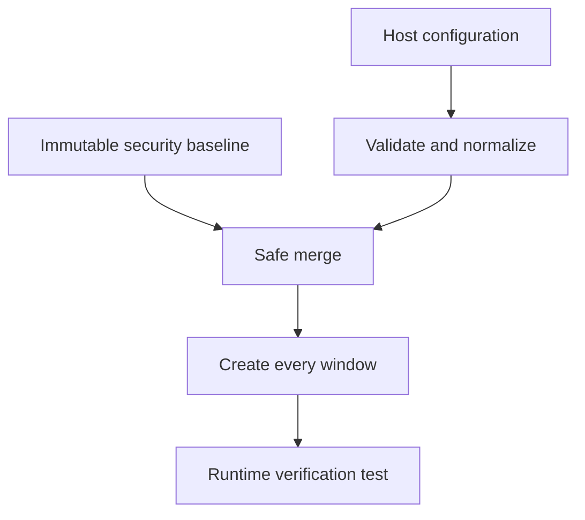
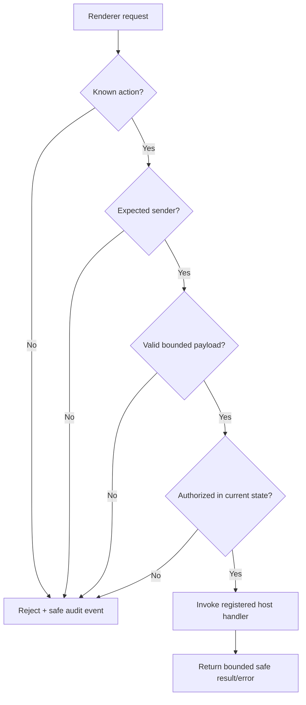
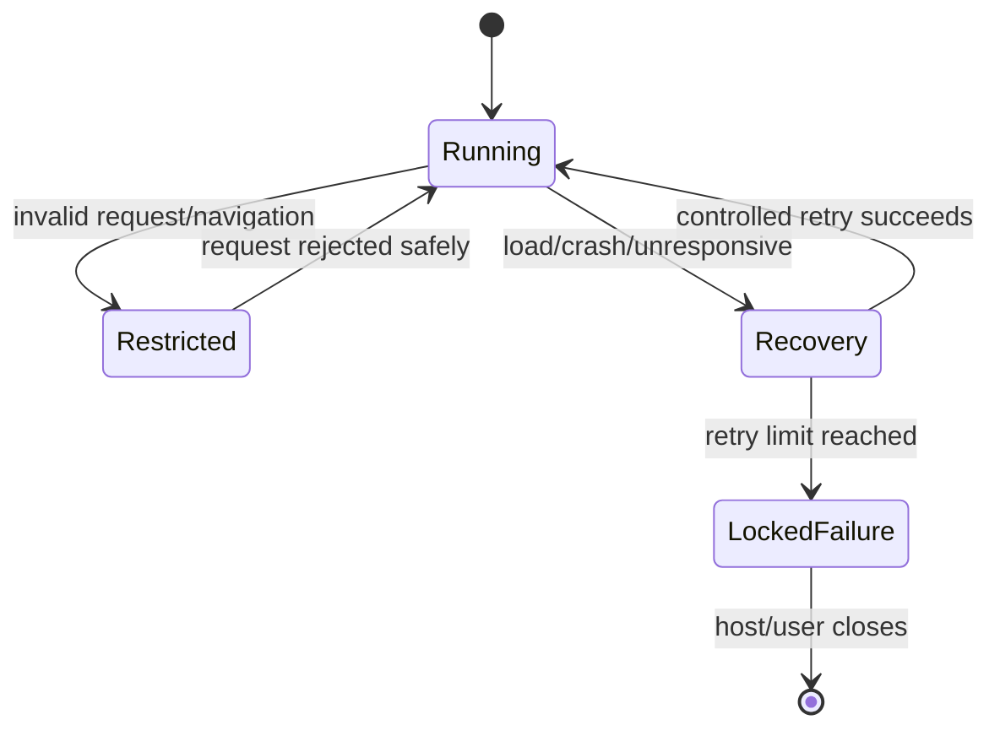
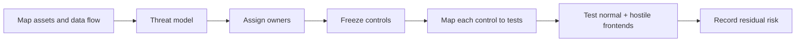

# Security Review Plan

## 1. Security goal

Frontend code must not gain privileged access simply because it runs inside the desktop application.

> Privilege stays in the host. The renderer is untrusted. Every boundary is explicit and validated.

## 2. Trust boundaries

Local production assets, development URLs, external navigation, child windows, sessions, dependencies, and updates create additional trust boundaries.

## 3. Ownership

| Shell owns | Host owns | Outside shell |
| --- | --- | --- |
| BrowserWindow hardening | Product action authorization | Gmail OAuth/scopes |
| Preload/IPC boundary | Secret and token lifecycle | Portal cookies/CAPTCHA/OTP |
| Navigation and permissions | Product schemas and data policy | Workflow recovery |
| Safe load/error events | Logging and retention | Database transactions |
| Shell security tests | Service coordination | Automation decisions |

## 4. Main threats and controls

| Threat | Required control |
| --- | --- |
| Renderer accesses OS/Node | Isolation, sandboxing, no Node integration |
| Arbitrary privileged action | Named allowlist; no raw IPC exposure |
| Malformed or huge request | Schema, depth, count, and byte limits |
| Spoofed request source | Verify sender window, frame, and origin |
| Malicious redirect or popup | Revalidate navigation; deny new windows by default |
| Dangerous permission/download | Deny by default; explicit host policy |
| Remote/development code in production | Local bundled assets and production policy |
| Secret leaked through error/log | Redaction and renderer-safe error shapes |
| Unsafe generic config override | Immutable mandatory security baseline |
| Repeated crash/reload attack | Bounded recovery with stable failure state |
| Cross-window capability leak | Per-window capability and session policy |
| Compromised dependency/update | Pinning, audit, signed release, rollback plan |

## 5. Mandatory BrowserWindow baseline

Baseline requirements:

- Context isolation enabled.
- Renderer Node.js integration disabled.
- Sandbox enabled for the approved preload design.
- Web security and certificate validation retained.
- No arbitrary Electron option passthrough.
- Same policy applied to every child or additional window.
- Development tools and development sources disabled in production by default.

Exact effective settings will be frozen against the selected Electron version before implementation.

## 6. Request decision gate

Never trust identity, origin, permission, or action claims contained only in renderer-provided payloads.

## 7. Content policy

| Content | Default policy |
| --- | --- |
| Packaged local frontend | Allow from validated package location |
| Local development URL | Allow only in explicit development mode |
| Redirect | Revalidate destination |
| External link | Validate, then delegate to system browser by policy |
| Popup / `window.open` | Deny unless explicitly approved |
| Remote script | Deny in production frontend policy |
| Permission/download/protocol | Deny unless host explicitly handles it |

A strict Content Security Policy is required. Ownership is shared: the shell enforces loading/navigation boundaries; the frontend build supplies compatible document directives.

## 8. Safe failures

Renderer-visible failures contain stable codes and safe messages. Host diagnostics may add redacted context, never tokens, cookies, credentials, private content, raw sensitive URLs, or unrestricted stack data.

## 9. Review flow

Required outputs:

1. Data-flow and trust-boundary diagram.
2. Threat register with likelihood, impact, owner, and mitigation.
3. Electron security baseline.
4. Source/navigation policy.
5. Versioned preload and IPC contract.
6. Control-to-test traceability matrix.
7. Residual-risk and release record.

## 10. Security release gate

- [ ] Renderer has no unrestricted Node.js, OS, filesystem, token, or cookie access.
- [ ] Mandatory window options cannot be weakened by host configuration.
- [ ] All requests verify action, sender, schema, size, permission, and state.
- [ ] Navigation, popups, permissions, downloads, and protocols fail closed.
- [ ] Production cannot accidentally use development sources or tooling.
- [ ] Errors, events, and diagnostics are bounded and redacted.
- [ ] Multiple windows cannot inherit unintended sessions or capabilities.
- [ ] Crash, hang, preload failure, and load failure paths are tested.
- [ ] Dependency, package, signing, update, and rollback ownership is documented.
- [ ] Windows and Linux packaged security tests pass.

Accepted security defaults and responsibility boundaries are recorded in [Design Decisions](design-decisions.md).
